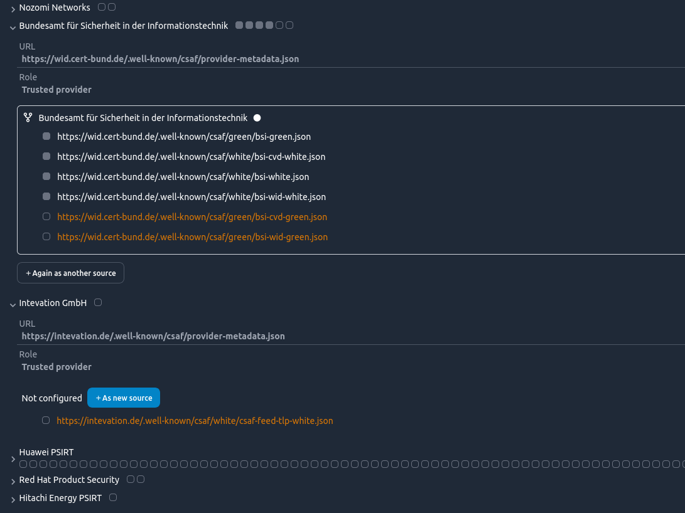
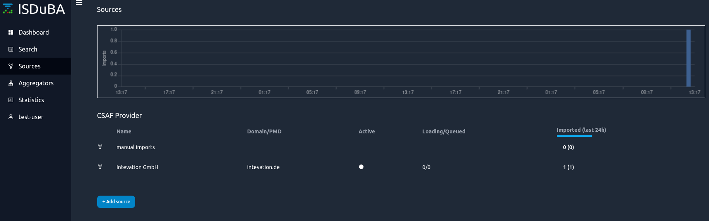
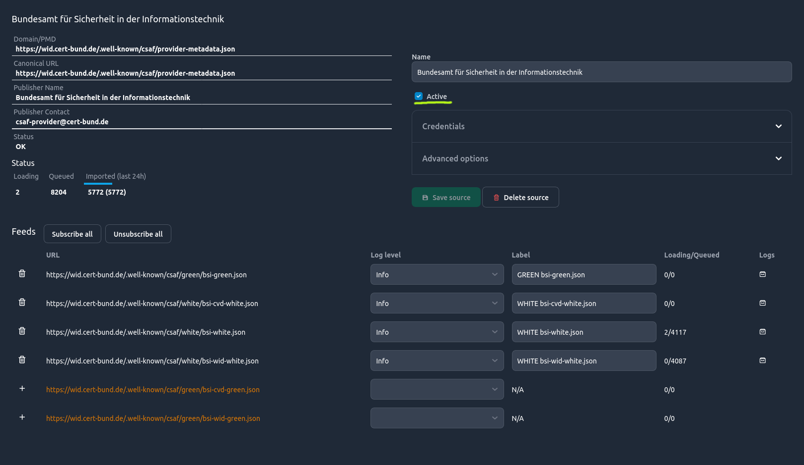
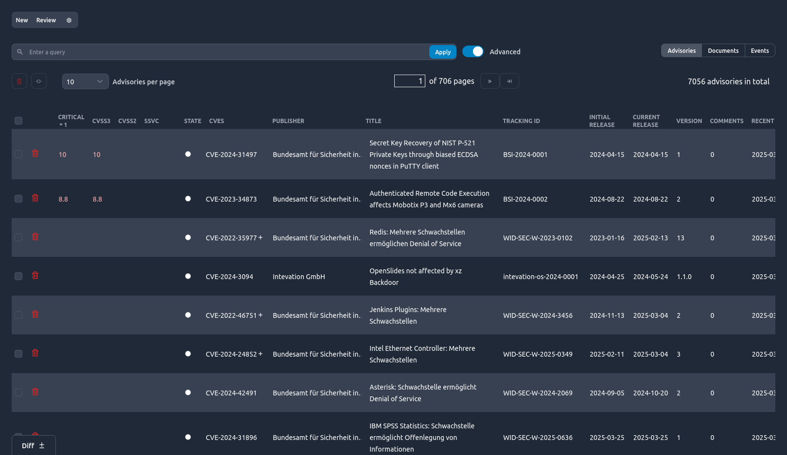
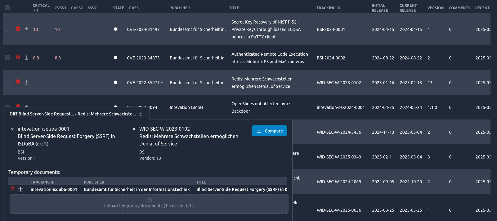
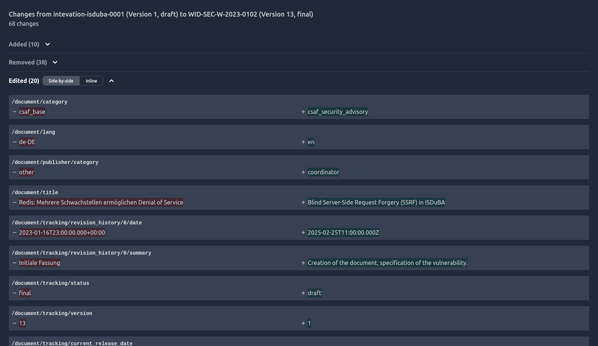

<!--
 This file is Free Software under the Apache-2.0 License
 without warranty, see README.md and LICENSES/Apache-2.0.txt for details.

 SPDX-License-Identifier: Apache-2.0

 SPDX-FileCopyrightText: 2025 German Federal Office for Information Security (BSI) <https://www.bsi.bund.de>
 Software-Engineering: 2025 Intevation GmbH <https://intevation.de>
-->

## Adding sources

Sources are what are primarily providing security advisories to ISDuBA. Managing which sources' advisories are important is the responsibility of the `source-manager` role.

An easy way to find new sources is via aggregators within the `aggregators` tab,
which per default contains the preconfigures but inactive "BSI CSAF Lister" as well as an option to configure additional aggregators.
Using these aggregators, the source-manager can create new sources by expanding an aggregator and then the desired source.

Finally, click on "+ As new source" to enter the [source-configuration dialogue](#configuring_sources).

Alternatively, they can utilize the Sources-Tab to add a source directly, specifying the domain or the location of a provider-metadata.json directly. 

### Configuring Sources
There are two steps to configuring a new source. First, all the metadata and source-feeds are listed, and the possibility to add credentials and downloading configuration (via Advanced options) are listed.
After saving the source via the "Save source" button, the source will be saved and listed in the sources tab and the user will be redirected into the overview for this source.

Here, the credentials provided and the download configuration can be altered at any time, and the logs for the feeds and some statistics can be viewed.
It's important to note that ISDuBA only starts importing once a source has been activiated by checking the "active" checkbox (highlighted by being underlined in the following screenshot).
Also, any change only takes effect after it has been saved via the "Save source"-button.

## Finding Advisories

When trying to find advisories, the search tab can be used to view all advisories that are accessible with the current permissions. Via the search bar, terms can be searched. An advanced search function, triggered by flipping the `Advanced` switch allows filtering more precisely [via filter expressions.](./search.md#filter-expressions)

Furthermore, the cogwheel on the upper left of the page allows creating stored queries which can be saved and used to quickly filter advisories. The `Dashboard` option will cause the stored query to appear on the dashboard. The `Hide` option will cause the stored query to be hidden everywhere, potentially to make room for other queries. `Query criteria` also allow filtering [via filter expressions.](./search.md#filter-expressions)

When the desired avisory is found, a detailed advisory view can be entered by clicking on it. Here, SSVC can be set and the advisory can be commented.

## Comparing Documents

On the bottom left of the search page, a `diff`-widget allows opening the diff-dialogue. While it's open, advisories on the search page can be selected by clicking the +-icon next to them. After having selected 2 advisories, their newest documents can be compared against each other in a [github-pr-diff](https://docs.github.com/en/pull-requests/collaborating-with-pull-requests/proposing-changes-to-your-work-with-pull-requests/about-comparing-branches-in-pull-requests)-based view. Users can also upload local documents temporarily to compare them against documents within the system. How many and for how long [is managed via the server configuration](https://github.com/ISDuBA/ISDuBA/blob/main/docs/isdubad-config.md#-section-temp_storage-temporary-document-storage).

There is also a possibility to compare different documents of an advisory by clicking the diff-icon next to the version numbers within an advisory. Which advisories are compared to each other can be changed via clicking on the version numbers.

